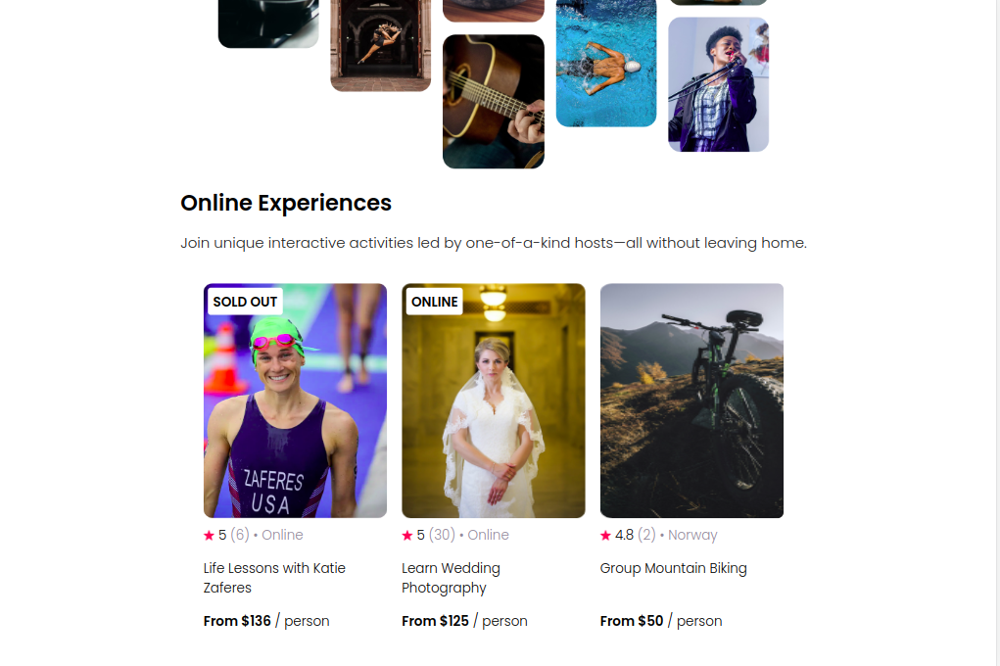

# AirBnb Experience page clone.

## Welcome! 👋
After a period of setbacks, I had gone back to learning React! This is a project from Bob Ziroll's scrimba course, it has helped me a lot to refresh my knowledge of react (props, conditional rendering, mimicking data gotten from api), as it gave me room to try out building this myself! It is a clone of the AirBnb experience page, it took the project a bit further to make it responsive on all screen sizes.

## How To Run? 🤔
Download this code either as a `zip file` or use the `git clone` command to clone it.
Then, open the project folder in your editor and on the integrated terminal:
-  Run `npm install` to install all the packages used for this project.
After the installation,
- Run `npm start` to run the project on your browser localhost.
    That's all you'd need to do 🙂

## Have A Feedback? 
Giving feedback is appreciated, if you any to give on this project please email me at beatriceebirim@gmail.com.

**Happy Coding 💪**
